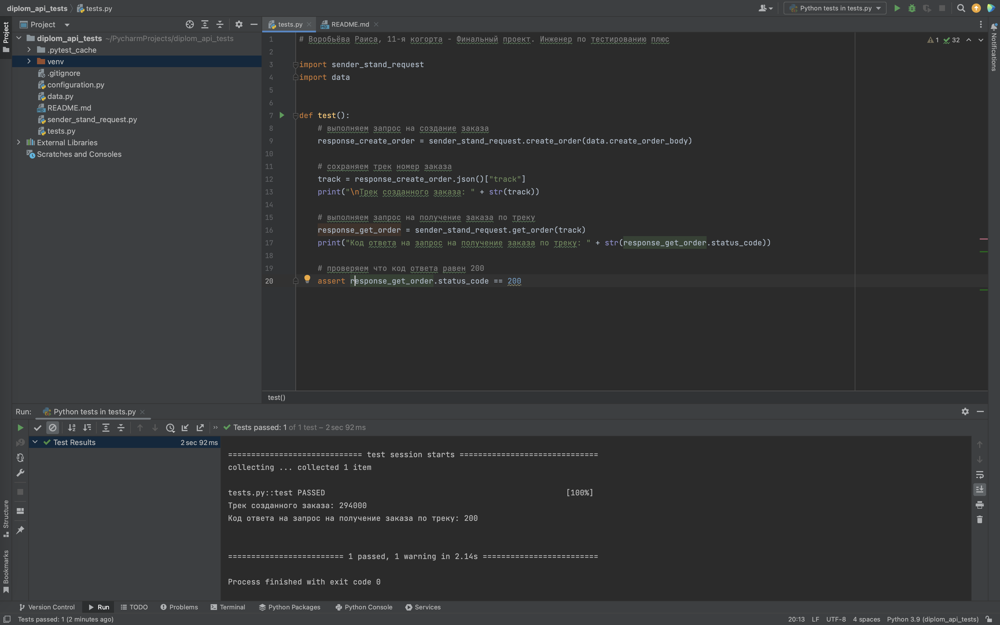

### Воробьёва Раиса, 11-я когорта - Финальный проект.<br>Инженер по тестированию плюс

# Тестовый сценарий
- Клиент создает заказ
- Проверяется, что по треку заказа можно получить данные о заказе.



# SQL-Запросы
### Задание 1:

``` sql
SELECT 
    c.login,
    COUNT(o.id) AS "Количество заказов в доставке"
FROM 
    "Couriers" c
INNER JOIN 
    "Orders" o ON c.id = o."courierId"
WHERE 
    o."inDelivery" = true
GROUP BY 
    c.login;
```

### Задание 2:

``` sql
SELECT
    o.track,
    CASE
        WHEN o.finished = TRUE THEN 2
        WHEN o.cancelled = TRUE THEN -1
        WHEN o."inDelivery" = TRUE THEN 1
        ELSE 0
    END AS "Статус"
FROM
    "Orders" o;
```